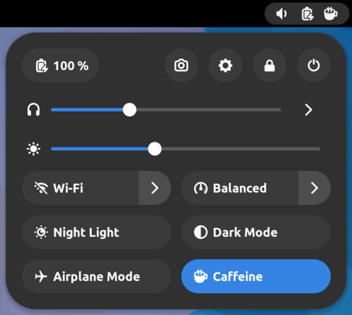
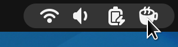
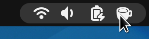
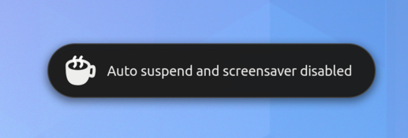
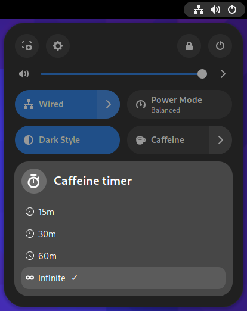
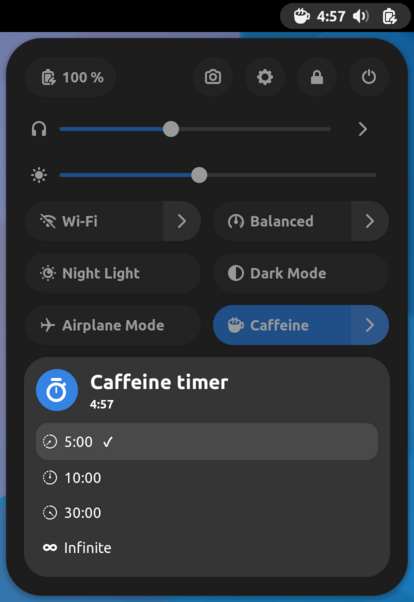
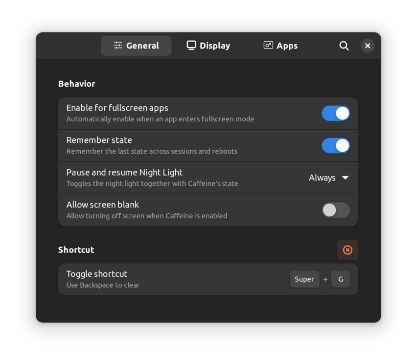

# gnome-shell-extension-caffeine

[](https://extensions.gnome.org/extension/517/caffeine/)

[](https://github.com/eonpatapon/gnome-shell-extension-caffeine/blob/master/LICENSE)
[](https://github.com/eonpatapon/gnome-shell-extension-caffeine/releases/latest)

Enable / disable auto suspend with quick setting toggle.



## Version

This extension supports GNOME Shell `3.4` -> `49`

|Branch                   |Version|Compatible GNOME version|
|-------------------------|:-----:|------------------------|
| master                  |    58 | GNOME 45 -> 49         |
| gnome-shell-43-44       |    51 | GNOME 43 -> 44         |
| gnome-shell-40-42       |    42 | GNOME 40 -> 42         |
| gnome-shell-3.36-3.38   |    37 | GNOME 3.36 -> 3.38     |
| gnome-shell-3.32-3.34   |    33 | GNOME 3.32 -> 3.34     |
| gnome-shell-3.10-3.30   |     - | GNOME 3.10 -> 3.30     |
| gnome-shell-before-3.10 |     - | GNOME 3.4 -> 3.8       |

## Installation From source

```bash
make build
make install
```

- Restart the shell
- Enable the extension

## Screenshots & features

### Scroll Indicator Icon



You can scroll on the indicator icon to enable / disable auto suspend:

- Scroll up -> Filled cup: Caffeine enabled
- Scroll down -> Empty cup: Caffeine disabled

__Note__: the option "Show status indicator" must be set on "always" (see below).

### Notifications




### Timer option

This option enable Caffeine for a given amount of time (similar to Caffeine in LineageOS).



### Preferences


