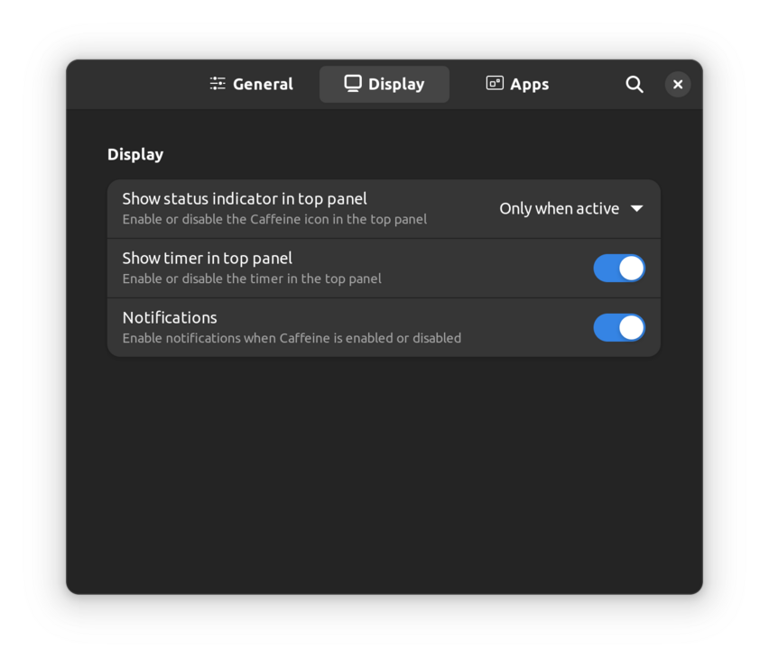
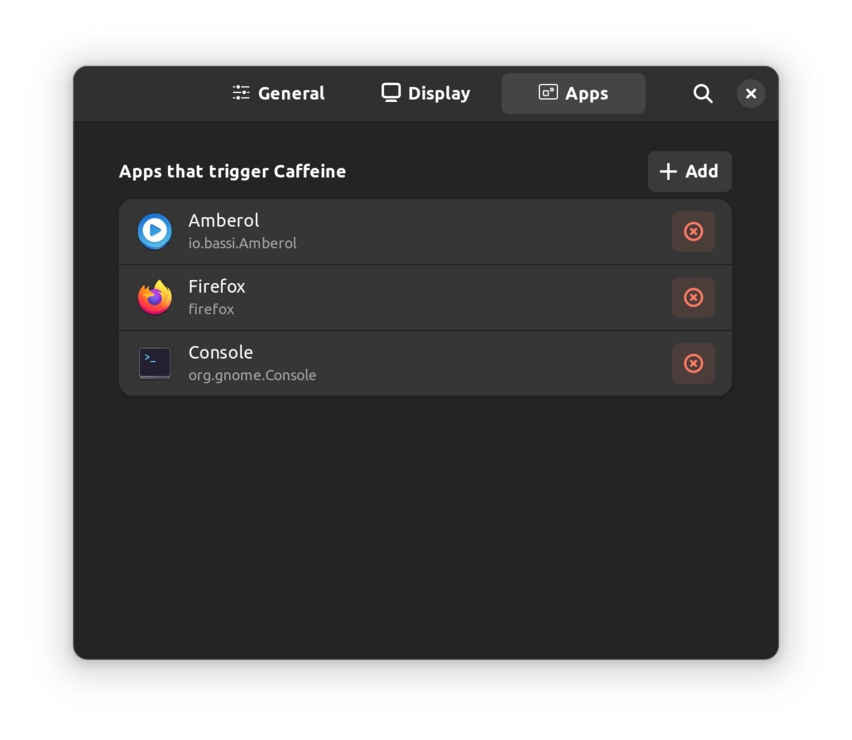

# This extension is barely maintained anymore, new maintainers are welcome!

## gnome-shell-extension-caffeine
  - Fill the cup to inhibit auto suspend and screensaver
  - This extension supports GNOME Shell `3.4` -> `43`
    - `master`: `43`
    - `gnome-shell-40-43`: `40` -> `43`
    - `gnome-shell-3.36-3.38`: `3.36` -> `3.38`
    - `gnome-shell-3.32-3.34`: `3.32` -> `3.34`
    - `gnome-shell-3.10-3.30`: `3.10` -> `3.30`
    - `gnome-shell-before-3.10`: `3.4` -> `3.8`

## Screenshots
### <ins>Quick Toggle</ins>


Enable/Disable auto suspend with quick setting toggle.


### <ins>Scroll Indicator Icon</ins>


You can scroll on the indicator icon to Enable/disable auto suspend:

- Scroll UP -> Filled cup : auto suspend and screensaver off. 
- Scroll DOWN -> Empty cup : normal auto suspend and screensaver.

<ins>__Note__</ins>: the option "Show status indicator" must be set on "always" (see below).


### <ins>Notifications</ins>


### <ins>Timer option</ins>
This option enable Caffeine for a given amount of time (similar to Caffeine in LineageOS).


### <ins>Preferences</ins>





## Installation from GNOME Extensions
  - Get the extension [here](https://extensions.gnome.org/extension/517/caffeine/)

## Installation from source
```
make build
make install
```
  - Restart the shell
  - Enable the extension

## CLI

- Get current state:
  ```sh
  gsettings --schemadir ~/.local/share/gnome-shell/extensions/caffeine@patapon.info/schemas/ get org.gnome.shell.extensions.caffeine user-enabled
  ```
- Enable Caffeine:
  ```sh
  gsettings --schemadir ~/.local/share/gnome-shell/extensions/caffeine@patapon.info/schemas/ set org.gnome.shell.extensions.caffeine user-enabled true
  ```
- Disable Caffeine:
  ```sh
  gsettings --schemadir ~/.local/share/gnome-shell/extensions/caffeine@patapon.info/schemas/ set org.gnome.shell.extensions.caffeine user-enabled false
  ```

`--schemadir` — path to the extension schemas directory. It may be different on your system.
